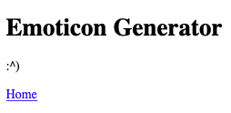

# Programming 101 Labs Redux

Create a Flask app that performs at least 2 of your Programming 101 labs.  
	
Include **at least one** of these:
### Labs without User Input
- [Emoticon Generator](https://github.com/PdxCodeGuild/Programming101/blob/master/labs/emoticon.md)
- [Password Generator](https://github.com/PdxCodeGuild/Programming101/blob/master/labs/password_generator.md)
- [Magic 8 Ball](https://github.com/PdxCodeGuild/Programming101/blob/master/labs/magic-8-ball.md) without User Input (Just ask your question aloud–like a real Magic 8 Ball!)

And **at least one** of these:
### Labs with User Input
- [Grading](https://github.com/PdxCodeGuild/Programming101/blob/master/labs/grading.md)
- [Guess the Number](https://github.com/PdxCodeGuild/Programming101/blob/master/labs/guess_the_number.md)
- [Magic 8 Ball](https://github.com/PdxCodeGuild/Programming101/blob/master/labs/magic-8-ball.md) *with* User Input (Show the user's question with the Magic 8 Ball's answer)

Only version 1 is required for each lab.

For the labs with user input, use URL converters (ask the user to type their input into the URL bar i.e.: `localhost:5000/grading/87` OR provide anchor tags for the user to click on to submit input `<a href="/guess-the-number/7">7</a>`).

There should be a home page served by an `index` view with links to each lab.  If you were to choose Emoticon Generator and Guess the Number, your `app.py` would look something like this:

```py
from Flask import flask, render_template
app = Flask(__name__)


@app.route('/')
def index():
	return render_template('index.html')


@app.route('/emoticon-generator/')
def emotiocon_generator():
	# emoticon generator code goes in here
	emoticon = '???'
	return render_template('emoticon-generator.html', emoticon=emoticon)


@app.route('/guess-the-number/')
def guess_the_number():
	# render a template that tells the user how to guess
	# using URL converters
	# i.e.: localhost:5000/guess-the-number/5
	return render_template('guess-the-number.html')

@app.route('/guess-the-number/<int:guess>/')
def guess_the_number_guess(guess):
	# check the guess to see how it compares to the secret number
	guess_result = 'low' # or 'high' or 'correct'
	return render_template('guess-the-number-guess.html', guess_result=guess_result)
```

And your `index.html` template (aka: home page), would like like this:
```html
<!DOCTYPE html>
<html lang="en">
<head>
	<meta charset="UTF-8">
	<meta http-equiv="X-UA-Compatible" content="IE=edge">
	<meta name="viewport" content="width=device-width, initial-scale=1.0">
	<title>Intro Labs Redux</title>
</head>
<body>
	<h1>Intro Labs Redux</h1>
	<p><a href="/emoticon-generator">Emoticon Generator</a></p>
	<p><a href="/guess-the-number">Guess the Number</a></p>
</body>
</html>
```

The pages do not need to have styling.  `<h1>`s and `<p>`s and an `<a>` tag linking back to the home page will do.



Feel free to reference your 101 labs.  The Python logic will be much the same, but the user interface will be completely different.