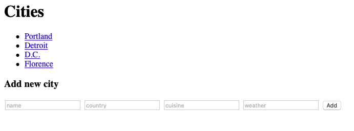

# Contacts List Redux

Create a Flask app that serves as a GUI (graphical user interface) version of your [Contacts List Python Lab](../../1%20Python/labs/12%20Contact%20List.md).

Transform your csv-formatted data into valid JSON (JavaScript Object Notation).  This example is of a list of `"cities"`, so change that key accordingly for your data.

```json
{
    "cities": [
        {
            "name": "Portland",
            "cuisine": "everything",
            "country": "USA",
            "weather": "temperate"
        },
        {
            "name": "Detroit",
            "cuisine": "Greek",
            "country": "USA",
            "weather": "temperate"
        },
        {
            "name": "D.C.",
            "cuisine": "ramen",
            "country": "USA",
            "weather": "temperate"
        },
        {
            "name": "Florence",
            "cuisine": "pasta",
            "country": "Italy",
            "weather": "hot"
        }
    ]
}
```

### Note on JSON:
Formatting is very important.  Keys must have double-quotes.  VSCode will let you know if JSON is improperly formatted.


## JSON-reading functions

You can use these functions to read from and write to your json file.  Of course, change `cities` to the appropriate term.
```py
import json

app = Flask(__name__)

def read_cities():
    """
Reads the contents of cities.json and returns the list of cities
    """
    with open('cities.json', 'r') as f:
        data = json.load(f)
    return data.get('cities')

def write_cities(cities):
    """
Passed a list of cities, writes those cities to the json file
    """
    with open('cities.json', 'w') as f:
        json.dump({'cities': cities}, f)
```

### Version 1: GET all Cities

Your Flask app will read your JSON file and list all the data on your home page (`localhost:500/`).

### Version 2 (Optional): POST a new City

Include a form on your home page for the user to submit a new entry to your json database through a POST request.

#### This is what your home page might look like with Versions 1 & 2


### Version 3 (Optional): GET individual Cities

Create a `detail` view and `detail.html` template to serve individual pages for each city (`localhost:5000/Portland`).  Also, alter the home page to show links to each city.

#### Your index page might look like this after Version 3


### Version 4 (Optional): POST requests to detail view
Add a form to your detail page for users to send patch requests (updates) to the `detail` view.

### Version 5 (Optional): POST requests to detail view
Add a form to your detail page so users can delete an entry from the json database.  The form can have just a submit button inside.

#### With Versions 3, 4 & 5, your detail page might look like this


Feel free to use this starter code in your `app.py`:
```py
# 127.0.0.1:5000/
@app.route('/', methods=['GET', 'POST'])
def index():
    """
Sent a GET request, this view lists all of the cities.
Sent a POST request, this view adds a new city to the
json file, and redirects back to the same view with a GET request
    """
    if request.method == 'POST':
        cities = read_cities() # read cities from json file
        # extract new city data from request.form
        # add new city dictionary to cities list
        write_cities(cities) # write updated cities to json file
        return redirect('/') # redirect back to the same view, as a GET request
    cities = read_cities() # read cities from json file
    # render index template, passing cities list as a context kwarg
    return render_template('index.html', cities=cities)


# 127.0.0.1:5000/Portland
@app.route('/<name>/')
def detail(name):
    """
This view renders a template with detailed information about one city
    """
    # read json files to get cities list
    # find the right city
    city ='???'

    # render detail template with that city as a context kwarg
    return render_template('detail.html', city=city)


@app.route('/<name>/update', methods=['POST'])
def update(name):
	"""
This view takes in a post request and updates an entry in the database.
Then it redirects back to the detail view.
	"""
    # read json files to get cities list
    # find the right city
    # extract data from form
    # update city in list of dictionaries
    # write file
    # redirect to city's GET request
    return redirect(f'/{name}/') # what if the view changes the city's name?


@app.route('/<name>/delete', methods=['POST'])
def delete(name):
	"""
This view deletes an entry from the databse and redirects back to the home page.
	"""
    # read json files to get cities list
    # find the right city
    # remove city from list of cities
    # write file
    # redirect back to home page
    return redirect('/')


app.run(debug=True)
```

### Version 6 (Optional): Use a SQL database instead of JSON

[SQL](https://en.wikipedia.org/wiki/SQL) (often pronounced "sequel"), or Structured Query Language, is a widely used language in relational database management.  Django uses something called an ORM (Object Relational Mapper) to perform all SQL operations under the hood.  A popular Python ORM is SQLAlchemy.  Check out this [tutorial](https://www.tutorialspoint.com/flask/flask_sqlalchemy.htm) on integrating SQLAlchemy with Flask.  If you want to get real down and dirty and write your own SQL queries, you can do so with the `sqlite3` library.  Check out the documentation [here](https://docs.python.org/3/library/sqlite3.html).